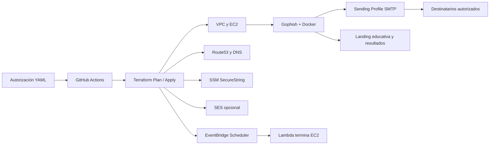

# gophish-platform

Plataforma interna para ejecutar campañas **autorizadas** de concienciación con Gophish. Crea un entorno temporal por cliente, valida la autorización, despliega Gophish en AWS, prepara campañas reproducibles y apaga la instancia cuando termina la ventana aprobada.

> No es una herramienta para obtener credenciales reales. Las campañas deben tener autorización documentada, destinatarios incluidos en el alcance y landing pages educativas que no soliciten ni almacenen contraseñas.

## Qué hace la aplicación

1. Lee la autorización de `clients/<cliente>/authorization.yaml`.
2. Bloquea el despliegue si falta autorización o la ventana temporal no está activa.
3. Crea VPC, subnet, Security Group, EC2, Elastic IP, DNS y roles IAM.
4. Arranca Gophish con Docker y obtiene secretos desde SSM.
5. Carga emails y landing pages del catálogo mediante la API de Gophish.
6. Crea la campaña con grupo, landing y Sending Profile SMTP.
7. Permite consultar y exportar resultados mínimos.
8. Programa una Lambda y EventBridge Scheduler para terminar la EC2 en `scope_end`.
9. Permite destruir los recursos restantes y conservar una auditoría.

La plataforma no crea un servidor SMTP propio. El correo usa un relay autorizado, un SMTP de pruebas o SES opcional.

## Arquitectura resumida



**Responsabilidades:** Terraform crea AWS; Gophish administra templates, landings, campañas y métricas; SMTP/SES transporta el correo; SSM protege secretos; Scheduler/Lambda limita la duración; GitHub Actions controla los cambios mediante OIDC.

## Estructura

```text
clients/<cliente>/       Autorización y configuración funcional
catalog/                  Emails JSON y landings HTML
automation/               Cliente REST, modelos, servicios y pruebas Python
scripts/                  Gate, deploy, destroy y comprobaciones
terraform/                Entornos, módulo AWS y rol CI
.github/workflows/        Plan y apply
docs/                     Arquitectura, despliegue y seguridad
```

## Requisitos e instalación

Se necesita Git, Python 3.11+, Terraform 1.7+, `uv`, AWS CLI y Bash. Docker solo es necesario para pruebas locales; el bootstrap lo instala en EC2.

En Windows:

```powershell
winget install --id astral-sh.uv -e
winget install --id Hashicorp.Terraform -e
```

Cierre y vuelva a abrir VS Code después de instalar:

```powershell
uv --version
terraform version
```

Si `uv` no aparece en la terminal integrada:

```powershell
$env:Path = [Environment]::GetEnvironmentVariable("Path", "User") + ";" + [Environment]::GetEnvironmentVariable("Path", "Machine")
```

## Preparar Python

Desde la raíz:

```powershell
uv sync --project automation --extra dev --locked
```

Esto crea `automation/.venv` e instala las versiones de `automation/uv.lock`. No es necesario activar el entorno para usar `uv run`.

## Pruebas

Las pruebas no necesitan AWS, credenciales, Docker ni Gophish real:

```powershell
uv run --project automation --extra dev pytest -q automation/tests scripts/tests
```

Resultado esperado actual: `12 passed`.

Pruebas separadas:

```powershell
uv run --project automation --extra dev pytest -q automation/tests
$env:PYTHONPATH = (Get-Location).Path
uv run --project automation --extra dev pytest -q scripts/tests
```

## Validaciones locales

```powershell
terraform fmt -check -recursive terraform
terraform -chdir=terraform/environments/acme-corp init -backend=false
terraform -chdir=terraform/environments/acme-corp validate
uv run --project automation --extra dev python scripts/check_yaml.py
bash -n scripts/*.sh
git diff --check
```

`init -backend=false` descarga providers, pero no usa el state remoto ni crea recursos. Conserva `.terraform.lock.hcl`. Con GNU Make, `make check` agrupa estas validaciones.

## Autorización

El archivo de autorización contiene `scope_start`, `scope_end`, `approved_by`, `signed_doc_ref`, `included_targets` y `excluded_targets`.

```powershell
python scripts/check_authorization.py --client acme-corp
```

Código `0` significa autorizado. Cualquier otro código bloquea. Puede fallar correctamente fuera de la ventana; no cambies fechas para forzar un resultado verde.

## Catálogo y campañas

Cada categoría de `catalog/` contiene un JSON de email y un HTML de landing enlazados por `landing_page_file`. `launch_campaign` valida autorización, crea el email, crea la landing sin captura de credenciales y crea la campaña con `group_ids` y `sending_profile_id` de `clients/<cliente>/config.yaml`.

Usa siempre `{{.URL}}` en los emails para conservar la correlación de Gophish. Consulta [catalog/README.md](catalog/README.md) para el inventario y las salvaguardas.

## Correo opcional con SES

SES está preparado, pero desactivado por defecto:

```hcl
enable_ses     = false
mail_domain    = ""
mail_from      = ""
mail_smtp_port = 587
```

Para activarlo, con dominio y autorización aprobados:

```hcl
enable_ses     = true
mail_domain    = "mail.example.com"
mail_from      = "awareness@mail.example.com"
mail_smtp_port = 587
```

Terraform prepara identidad SES, verificación TXT, DKIM y `mail-config` en SSM. Las credenciales `smtp-user` y `smtp-password` se cargan fuera de Git:

```powershell
aws ssm put-parameter --name /gophish-platform/acme-corp/smtp-user --type SecureString --value "VALOR_REAL" --overwrite
aws ssm put-parameter --name /gophish-platform/acme-corp/smtp-password --type SecureString --value "VALOR_REAL" --overwrite
```

Antes de enviar: verifica dominio, SPF, DKIM, DMARC, región, sandbox, límites y remitente. Configura el Sending Profile con `email-smtp.<region>.amazonaws.com`, puerto `587` o `465`. Activar SES no envía por sí solo.

## Despliegue controlado

No ejecutes `scripts/deploy.sh` localmente: exige GitHub Actions con OIDC.

1. Completa autorización y configuración sin secretos.
2. Crea una rama distinta de `main`.
3. Ejecuta pruebas y validaciones locales.
4. Abre un Pull Request.
5. Revisa Terraform Plan, tfsec y Checkov.
6. Obtén aprobación del environment protegido `production`.
7. Ejecuta manualmente Terraform Apply.
8. Verifica DNS, health check, administración y campaña de prueba.

El workflow necesita `AWS_DEPLOY_ROLE_ARN` y `AWS_REGION`. Antes del primer apply deben existir bucket S3 de state, tabla DynamoDB de locking, zona Route53 y parámetros externos SSM.

## Alta de cliente y retirada

Para un cliente nuevo, copia `clients/acme-corp` y `terraform/environments/acme-corp`, cambia el identificador, completa autorización y `terraform.tfvars`, prepara backend/DNS/SSM y abre un Pull Request.

Al finalizar:

```bash
scripts/destroy.sh acme-corp
```

La Lambda programada termina EC2 en `scope_end`; el destroy limpia los recursos restantes. No versiones API keys, credenciales SMTP, documentos firmados ni informes sensibles.

## Limitaciones conocidas

- El Sending Profile requiere un SMTP autorizado y configuración final en Gophish.
- SES prepara infraestructura, pero requiere verificación del dominio y revisión de entregabilidad.
- La autorización valida estructura y ventana; el responsable debe confirmar que objetivos y dominio coincidan con el documento aprobado.
- Las landings son simulaciones educativas y no deben modificarse para recoger credenciales.

Más detalle: [docs/architecture.md](docs/architecture.md), [docs/deployment.md](docs/deployment.md) y [docs/security.md](docs/security.md).
