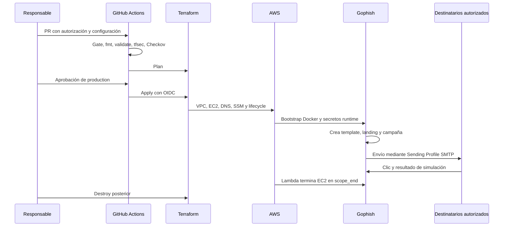

# Arquitectura

## Objetivo

La plataforma administra campañas internas autorizadas de concienciación como entornos temporales y reproducibles. La autorización es el punto de entrada; Terraform crea la infraestructura; Gophish gestiona la campaña; Scheduler limita su duración.

## Flujo completo

## Capas

### Autorización

`clients/<cliente>/authorization.yaml` contiene cliente, ventana temporal, aprobador, documento firmado y alcance. `scripts/authorization.py` y `scripts/check_authorization.py` bloquean el despliegue si falta información o la ventana no está vigente.

### Automatización Python

`automation/src/gophish_platform` contiene el cliente HTTP tipado, modelos Pydantic, servicios de campañas, reportes y lifecycle. `campaign_service.py` carga el catálogo, crea email y landing y asocia la campaña a un grupo y Sending Profile.

### Infraestructura AWS

El módulo `terraform/modules/gophish-instance` crea VPC, subnet pública, Security Group, EC2 Amazon Linux, IMDSv2, volumen cifrado, Elastic IP, Route53, IAM, SSM, Lambda y EventBridge Scheduler. El puerto 443 sirve la campaña; `3333` queda limitado por `admin_allowlist_cidrs`.

### Secretos y runtime

Terraform crea marcadores SSM con `PROVISION_EXTERNALLY` e ignora sus valores. Los operadores cargan API keys, contraseñas y, si SES está activo, credenciales SMTP fuera de Git. El rol de EC2 solo recibe permisos de lectura para los parámetros de su cliente.

### Correo

La plataforma no incluye un servidor SMTP propio. Gophish usa un Sending Profile. SES es opcional: con `enable_ses = true`, Terraform crea identidad de dominio, verificación TXT, DKIM y configuración SMTP no secreta. Las credenciales se cargan externamente y la configuración final del Sending Profile se revisa en Gophish.

## Componentes y responsabilidades

| Componente | Responsabilidad |
|---|---|
| Autorización YAML | Cliente, objetivos y fechas aprobados |
| GitHub Actions | Validación, plan y apply controlado |
| Terraform | Recursos AWS y lifecycle |
| EC2/Docker | Ejecución temporal de Gophish |
| Gophish | Templates, landing, campaña y resultados |
| SMTP/SES | Transporte del correo saliente |
| SSM | Secretos y configuración runtime |
| Scheduler/Lambda | Apagado por fin de ventana |

## Límites de confianza

- No se almacenan API keys, contraseñas SMTP ni documentos firmados en Git.
- OIDC debe limitarse al repositorio, workflow y environment esperados.
- El puerto administrativo `3333` no debe abrirse a Internet.
- Solo se usan destinatarios autorizados y campañas dentro de la ventana aprobada.
- Los informes deben tener acceso y retención limitados.
